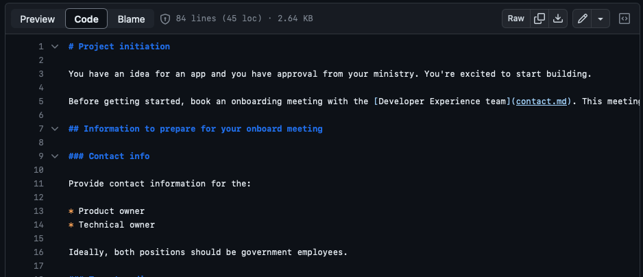
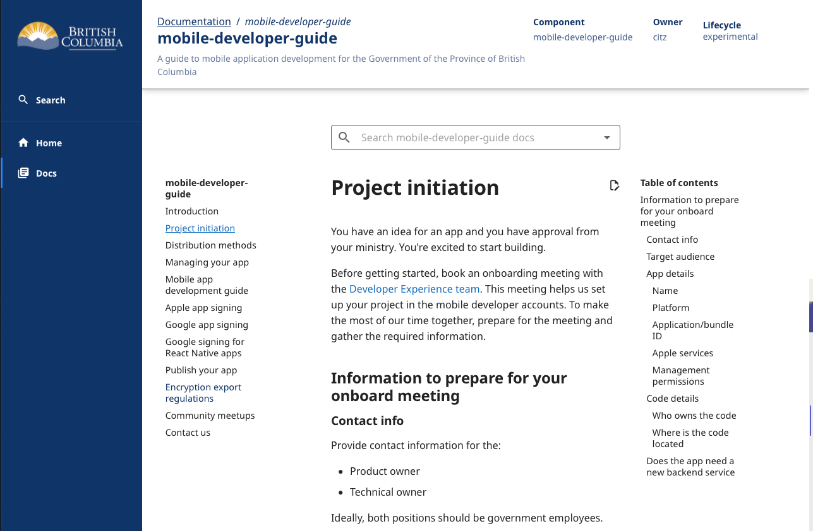

# DevHub Content Partner Guide

This guide is for you, if you or your B.C. government team:

- has a component, service, or platform that aims to make the work of developing software applications for the B.C. government better, faster, or more consistent
- has technical documentation that technologist should have access to in order to learn about or use your offering
- would like to publish your documentation in the DevHub alongside documentation for other offerings already in use by technologists working for the B.C. government

## What is DevHub?

DevHub is the "landing page for developers" within the B.C. government. It's a work in progress, but we're (we being the [Developer Experience Team](mailto:developer.experience@gov.bc.ca) within the OCIO's Digital office) working to bring together access to as many of the tools, services, and documentation source as possible that technologists need in order to be successful at their jobs of building the next generation of the province's digital services.

## What kind of documentation lives in DevHub?

Documentation in DevHub is technical in nature and helps technologists (developers, DevOps specialists, data scientists, architects, SREs, and more) in their day-to-day work. Business-oriented, non-technical documentation, even if it shares topics with what's in DevHub belongs elsewhere. In parallel to the work we are doing, the [Content Design Team](mailto:do.contentdesign@gov.bc.ca) within the OCIO's Digital Office is working to bring together non-technical documentation in the province's [Digital Government](https://digital.gov.bc.ca) site.   

## How does documentation work in DevHub?

As a small team, we are focused on building the DevHub (and a few other things) but we look to content partners (like you!) for most of the documentation in the site. Since you're the expert about the topics you're documenting, we've designed DevHub and related processes to give you flexibility about how and when your documentation is published within DevHub. There are a few setup steps, which we'll cover below) but after that, you and your team are in control.

We work with several content partners who each work on their own timelines, independently of ours for building DevHub. DevHub is designed for this, and once set up, each content partner can work at their own pace for updating their documentation without impacting each other or relying on our team. Similarly, we can work on improving the DevHub on our timelines without affecting our content partner's documentation work. To enable this, content partners each work in their own GitHub repository, and we work in ours. When a content partner has a version of their documentation ready to publish, it gets automatically published into DevHub and is visible to end users instantly. Content partners also have the ability to preview their content prior to it being available on DevHub. 

Much of the publishing process is enabled through use of GitHub features. The diagram below provides a simple illustration of the overall process, and an explanation of each step follows.

As a documentation writer, you edit or create files that will eventually be published in DevHub in your team's GitHub repository . When you want to preview your documentation, you can save your files to a preview branch (any branch other than a repo's default/main branch) in GitHub and after a few moments, it will then be available for review on the [preview instance of DevHub](https://dev.developer.gov.bc.ca). Once you're happy with your edits, you'll save your files into your repository's main branch. In this case, after a few moments, your latest documentation will be published and available on the [production DevHub instance](httsp://mvp.developer.gov.bc.ca). Each time you have changes or additions to make to your documentation, you iterate through this same process.

## What format is used for DevHub documentation?

DevHub documentation uses the popular Markdown format. Markdown is a simple, text based format that makes writing for the web much easier than using other more complicated formats like HTML. Even though it's simple, Markdown allows writers to use multi-level headings., different text styles, and add tables, images and diagrams. There are many excellent reference on the Internet for writing in Markdown, including this ["cheat sheet"](https://www.markdownguide.org/cheat-sheet/).  

Within DevHub, navigation is driven by a special configuration file called `mkdocs.yml` that is stored in the same GitHub repository as the Markdown files. This file uses the `yml` (pronounced "YAM-EL") format that is slightly more complicated than Markdown, but only infrequently updated. We can provide examples and support for working with this file if you need it. 

## What tools can I use to write my documentation?

There are many tools that you can use to write your documentation in Markdown. We provide some examples below.

### GitHub web interface 

The simplest option for editing your Markdown files is to work on them within GitHub's web interface, which provides a way to edit any text file contained in a GitHub repository.  Using this approach, you can make quick edits, get a preview, and save the changes back to your repository.

### Desktop code or text editor with Markdown plugin

Another way to edit Markdown files is to install a code or text editor on your workstation with plugins for working with Markdown and GitHub. PLugins can help check your syntax and show you a quick preview. Examples of these kinds of tools would be [VS Code](https://code.visualstudio.com) and [Sublime Text](https://www.sublimetext.com), but there are many others. These tools will also help getting your Markdown files into GitHub, but it's not quite as simple as using the GitHub web interface.

### Dedicated desktop Markdown editor

One more way to work with Markdown is to install a dedicated Markdown editor on your workstation. There are lots of [options](https://github.com/mundimark/awesome-markdown-editors), but we haven't tried them all. One lightweight option that we have tried for Mac users is [Macdown](https://macdown.uranusjr.com). Using a dedicate Markdown editor, you will usually need a way to get your files stored in GitHub. If you're comfotable with terminal commands, then you can use a [`git` command line client](https://git-scm.com/downloads). If you prefer visual interfaces, tools like [GitHub Desktop](https://desktop.github.com) and [GitKraken](https://www.gitkraken.com) are options.

## What will my documentation look like when it's published?

The appearance of your content is determined by the Markdown syntax you include (headings, text styles, images, etc.) as well as the enhancements and styling provided by DevHub. For example, DevHub will enhance your Markdown with search, and page and document-level navigation. It will also apply styling consistent with B.C. government's visual identity.

The images below provide an example of how a Markdown snippet in GitHub (first image) is displayed within DevHub (second image).

## How do we get set up to have our documentation published in DevHub?

The answer is...it depends. If you have existing technical documentation in Markdown format in GitHub, it shouldn't be much work to get it published in DevHub. If you don't have any technical documentation, or it is another format or managed outside GitHub, you'll probably a bit more work and learning to do.  

We're working on a "self serve" way for teams to add their documentation to DevHub, but in the meantime, the process looks like this:

1. Set up an overview meeting with [us](mailto:developer.experience@gov.bc.ca). From your team, we suggest including the Product Owner as well as anyone else involved in writing technical documentation for your product or service. It's also helpful to have a technical person from your team who understands the technical tools and processes you're already using. During this meeting, we'll provide an overview of DevHub, answer any questions you have, and talk about next steps (see below). Be prepared to discuss your existing technical documentation, related tools and processes, and what goals you have going forward.
2.  Following the overview meeting, we will recommend a working session between ourselves and one or more  technical team members to adapt your existing documentation process to one that is compatible with DevHub. The goal of the working session is to get your team comfortable working in a DevHub-compatible workflow, as well as identifying any changes needed to your content in order for it to be publishable in DevHub.
3. After the working session, your team may have some "homework" to adapt content or implement automated tools. The amount of work will depend on that is uncovered in the working session. You can complete these items on your own timeline.
4. Once your "homework" is completed, you can contact us and let us know that you are ready to have an initial version of your documentation published in DevHub. We will complete a small technical "registration" task and your documentation will be available within DevHub shortly afterwards.

## What kinds of modifications are needed to existing technical documentation in Markdown in order to work in DevHub?

The answer is, again...it depends. In general there is minimal to moderate effort required to adapt content for compatibility with DevHub. Below is a list of some of the adaptations we've encountered so far. You may encounter some or these or none of them, depending on your current documentation.

- May need to adjust link syntax as there are some differences across Markdown variants 
- May need to replace absolute links to pages within same document with relative links
- May need to align case of filenames and references links as DevHub is case-insensitive, unlike some other tools
- May need to adjust some formatting/spacing as DevHub is more particular about use of whitespace than some other tools 
- May need to check that HTML within Markdown is handled as expected and DevHub behaves differently than some other tools

We have automated tools to fix or help with most of the items above and can support you and your team as you adapt your documentation for DevHub. We expect most of these items will surface during the working session discussed above.

